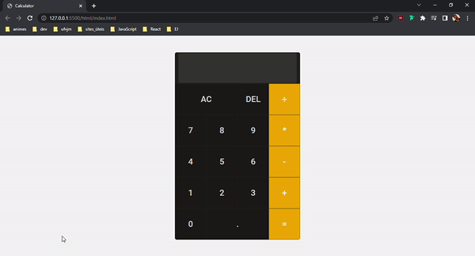

# Calculator-js
Calculadora básica, desenvolvida utilizando HTML5, CSS3 e JavaScript.

## Tecnologias

Projeto desenvolvido utilizando:

* [HTML5](https://developer.mozilla.org/pt-BR/docs/Web/HTML): Linguagem de marcação;

* [CSS3](https://developer.mozilla.org/pt-BR/docs/Web/CSS): Linguagem de design gráfico.

* [JavaScript](https://developer.mozilla.org/pt-BR/docs/Web/JavaScript): Linguagem de Programação Web.

* [Visual Studio Code](https://code.visualstudio.com/): IDE de desenvolvimento do projeto.

* [Ubuntu](https://ubuntu.com/) : Distribuição Linux

### Calculadora desenvolvida

    

### Autor:
    Aguinele Queiroz da Silva

